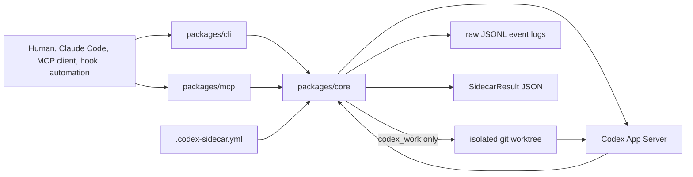

<p align="center">
  
</p>

# codex-sidecar

[](https://www.npmjs.com/package/codex-sidecar-cli)
[](https://www.npmjs.com/package/codex-sidecar-mcp)
[](https://github.com/kitepon-rgb/codex-sidecar/actions/workflows/ci.yml)
[](LICENSE)
[](https://nodejs.org)
[](https://github.com/kitepon-rgb/codex-sidecar/releases)

[English](README.md) · **日本語**

> **Codex を安全な隔離 sidecar として呼び出し、チャットの会話ログではなく機械可読な答えを受け取る。**
> `codex-sidecar` は、人間・Claude Code・MCP client・hook から Codex にコードレビュー、調査、リスク確認、限定的な修正を依頼でき、active working tree に一切触れずに 1 回ごとに構造化された `SidecarResult` JSON を返します。

[Usage](docs/USAGE.md) · [Architecture](docs/ARCHITECTURE.md) · [Protocol](docs/PROTOCOL.md)

`codex-sidecar` は、Claude Code や MCP client、hook、その他の自動化から Codex を呼ぶための共通実行レイヤーです。Codex を主役に置き換えるのではなく、別視点のレビュー、調査、設計への反対意見、限定的な修正能力を安全な境界つきで差し込みます。

OpenAI API gateway でも画像生成 proxy でもありません。Codex App Server の実行、結果 JSON の正規化、raw log、worktree 隔離、安全 policy をまとめて扱うための土台です。
Codex の既存 model 設定を継承することも、workflow ごとに明示的な model policy を指定することもできます。

## 30 秒で試す

workspace を build:

```bash
npm install -g codex-sidecar-cli
npm install -g codex-sidecar-mcp
```

`codex-sidecar-mcp` は npm の `bin` として配布されます。global install では
PATH 上のコマンドが symlink になるため、この symlink 経由でも MCP stdio
server が起動することをテストで固定しています。

source から build する場合:

```bash
corepack pnpm install
corepack pnpm build
```

対象 repo の設定解決を確認:

```bash
codex-sidecar diagnostics \
  --project /path/to/project \
  --preset review \
  --model gpt-5.5 \
  --model-reasoning-effort medium
```

Codex に read-only 調査を依頼:

```bash
codex-sidecar explore \
  --project /path/to/project \
  "request safety がどこで検証されるか、file reference つきで答えて。"
```

隔離 worktree で小さな修正を依頼:

```bash
codex-sidecar work \
  --project /path/to/project \
  --preset work \
  "parser の最小 regression test を追加して。"
```

`codex_work` は生成した worktree をデフォルトで残すため、人間や呼び出し元が diff を確認してから取り込めます。

## Workflow

| CLI workflow | MCP tool | 目的 | 書き込み | 主な出力 |
|---|---|---|---:|---|
| `review` | `codex_review` | diff / branch / patch のレビュー | なし | `findings`, `missingTests`, `residualRisks` |
| `explore` | `codex_explore` | codebase 調査 | なし | `summary`, `fileReferences` |
| `opinion` | `codex_opinion` | 設計や方針への反対意見 | なし | `recommendation`, `objections`, `assumptions` |
| `risk-check` | `codex_risk_check` | secrets / MCP / OAuth / hooks / Docker / CI の重点確認 | なし | `risks`, `sourceBoundaries` |
| `auditor` | `codex_auditor` | primary tool-use auditor 判定 | なし | `pass`, `missingTools` |
| `generate` | `codex_generate` | freeform タスク向けに任意の構造化 JSON を生成 | なし | `generated`（生の JSON object/array） |
| `work` | `codex_work` | 小さな実装作業 | 隔離 worktree のみ | `changedFiles`, `tests`, `worktreePath` |

すべての workflow は `SidecarResult` JSON を返します。下流ツールは prose を読むのではなく、構造化 field を利用できます。`status` は `ok` / `failed` / `refused` / `dry-run` / `partial` のいずれかで、`partial` は「ターンは完走したが報告が schema から逸脱した」状態を表します。この場合、生報告は `unvalidatedReport` に保存され、無損失の正規化は `normalizationNotes` に開示されます（詳細は [docs/USAGE.md](docs/USAGE.md#degraded-report-status-partial)）。`codex_review` の呼び出しはおおむね次のような結果を返します:

```json
{
  "status": "ok",
  "workflow": "review",
  "summary": "No blocking regressions found.",
  "confidence": {
    "level": "medium",
    "rationale": "The review inspected the changed files but did not run tests."
  },
  "recommendedNextAction": "Run the relevant package tests before merging.",
  "fileReferences": [
    { "path": "packages/core/src/requests.ts", "line": 42, "label": "request execution boundary" }
  ],
  "rawEventLogRef": "/path/to/project/.codex-sidecar/logs/app-server/..."
}
```

workflow 固有 field がこの共通 field の上に乗ります — `review` は `findings` / `missingTests` / `residualRisks`、`work` は `changedFiles` / `tests` / `worktreePath` などを追加します。完全な contract は [docs/USAGE.md](docs/USAGE.md#structured-result-contract) を参照してください。

### 長時間 work

従来の同期 `work` は直接実行用として引き続き使えます。MCP stdio の切断や
呼び出し元の再起動をまたいで実行する必要がある場合は、非同期 control を使います。
CLI は `work-start` / `work-result` / `work-cancel` / `work-recover` /
`work-auth-recover`、MCP は `codex_work_start` / `codex_work_result` /
`codex_work_cancel` / `codex_work_recover` / `codex_work_auth_recover` を提供します。

呼び出し元は idempotency key を生成して保持します。同じ key での retry や
再取得は新しい run を作らず、同じ耐久 run を参照します。handoff 成功後の worker
は切り離されるため、stdio の切断後や新しい CLI/MCP process からも同じ key で
結果を取得できます。異常 kill 後に patch や worktree を自動 salvage / cleanup
することはありません。quarantine と auth recovery は確認を要する明示操作で、
詳細な回復制約は [docs/USAGE.md](docs/USAGE.md#asynchronous-work) を参照してください。

### GPT-5.6 長時間タスク設定

GPT-5.6 で長い context が必要なタスクは、user global config または trusted
project の `.codex/config.toml` に次を設定します:

```toml
model_context_window = 272000
model_auto_compact_token_limit = 240000
```

user global 側については、sidecar がこの 2 key と許可された top-level model key
だけを隔離 `CODEX_HOME` へ allowlist copy し、TOML table はコピーしません。
trusted project override は隔離 home へコピーせず、Codex が thread の working
directory から読みます。非同期 work では isolated worktree に含まれるよう、override
を run の base commit に入れておく必要があります。App Server 起動時は inherited
MCP server と plugin も引き続きクリアします。

## 何が嬉しいか

| 直接使う手段 | 得意なこと | `codex-sidecar` が足すもの |
|---|---|---|
| Codex CLI 直叩き | 対話的な Codex session | 安定した request/result JSON、raw log、preset、安全 policy |
| Claude Code 単独 | 主作業の実行 | Claude の文脈を壊さず Codex の別視点を足す |
| repo 固有の MCP tool | 1 つの workflow | CLI/MCP/core contract を複数 repo で共有 |
| active tree への直接自動編集 | 速い local edit | `codex_work` が worktree に閉じ込め、changed files を返す |

## 構成



CLI と MCP package は薄く保ち、`packages/core` が config、preset、安全 policy、App Server protocol、structured output、raw log、worktree 隔離を担当します。

## LAN MCP サーバー (Docker)

`packages/mcp` は npm `bin` 経由の stdio transport に加え、Streamable HTTP
transport を持っています。HTTP モードを使うと 1 台のホストで LAN 内の複数
MCP クライアント (別マシンの Claude Code、hook、automation) に対して
codex-sidecar を提供でき、すべてのワークステーションに
`codex-sidecar-mcp` を入れる必要がなくなります。

リポジトリには `Dockerfile` と `docker-compose.yml` が同梱されており、
選択した LAN IP のみにバインドします:

```bash
# sidecar を動かすホスト側
git clone https://github.com/kitepon-rgb/codex-sidecar.git
cd codex-sidecar
docker compose up -d --build
```

デフォルトは `192.168.1.2:39201/tcp` にバインドし、`~/.codex` (Codex CLI 認証)
と `~/projects` (対象 repo 群) をコンテナにマウントします。ホストごとに
env または `.env` で上書きできます:

```bash
CODEX_SIDECAR_BIND_HOST=10.0.0.5 \
CODEX_SIDECAR_PORT=39201 \
CODEX_HOME_HOST=/home/alice/.codex \
PROJECTS_HOST=/home/alice/projects \
docker compose up -d --build
```

UFW などでローカル subnet からのみアクセスできるよう制限します:

```bash
sudo ufw allow from 192.168.1.0/24 to any port 39201 proto tcp comment 'codex-sidecar-mcp LAN'
```

bearer token を強制したい場合は compose で `CODEX_SIDECAR_MCP_BEARER` を
設定するとクライアントに `Authorization: Bearer <token>` を要求します。
DNS rebinding 保護 (`CODEX_SIDECAR_MCP_ALLOWED_HOSTS`) はデフォルトで
有効です。MCP SDK は `Host` ヘッダを verbatim で照合するため、bare host
と `host:port` の両形を列挙する必要があります。

MCP クライアント設定例:

```json
{
  "mcpServers": {
    "codex-sidecar-lan": {
      "type": "http",
      "url": "http://192.168.1.2:39201/mcp"
    }
  }
}
```

呼び出し側はクライアントマシンのパスではなく、サーバー側のパス (例:
`/projects/<repo>`) を `projectRoot` に渡してください。

詳細は [docs/USAGE.md](docs/USAGE.md#http-transport-and-lan-deployment) を
参照してください。

## 詳細

- [docs/USAGE.md](docs/USAGE.md): CLI / MCP / worktree / raw log / structured result の使い方。
- [docs/README.md](docs/README.md): docs index と archive map。
- [docs/ARCHITECTURE.md](docs/ARCHITECTURE.md): package 境界、layering、安全 model、result contract。
- [docs/PROTOCOL.md](docs/PROTOCOL.md): Codex App Server との protocol 境界。
- [docs/archive/CODEX_MODEL_POLICY_TODO.md](docs/archive/CODEX_MODEL_POLICY_TODO.md): 完了済み Codex model policy 計画。

## 開発

```bash
corepack pnpm typecheck
corepack pnpm test
corepack pnpm build
```

## License

MIT
