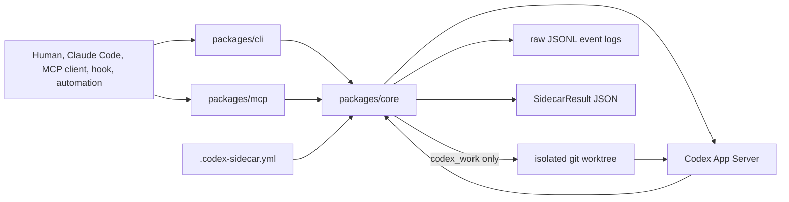

# codex-sidecar

<p align="center">
  
</p>

[](https://github.com/kitepon-rgb/codex-sidecar/actions/workflows/ci.yml)
[](LICENSE)

> Codex を安全な sidecar として呼び出し、レビュー、調査、リスク確認、小さな修正を active working tree から切り離して実行する。

[English README](README.md) | [Usage](docs/USAGE.md) | [Architecture](docs/ARCHITECTURE.md) | [Protocol](docs/PROTOCOL.md)

`codex-sidecar` は、Claude Code や MCP client、hook、その他の自動化から Codex を呼ぶための共通実行レイヤーです。Codex を主役に置き換えるのではなく、別視点のレビュー、調査、設計への反対意見、限定的な修正能力を安全な境界つきで差し込みます。

OpenAI API gateway でも画像生成 proxy でもありません。Codex App Server の実行、結果 JSON の正規化、raw log、worktree 隔離、安全 policy をまとめて扱うための土台です。

## 30 秒で試す

workspace を build:

```bash
npm install -g codex-sidecar-cli
npm install -g codex-sidecar-mcp
```

source から build する場合:

```bash
corepack pnpm install
corepack pnpm build
```

対象 repo の設定解決を確認:

```bash
codex-sidecar diagnostics \
  --project /path/to/project \
  --preset review
```

Codex に read-only 調査を依頼:

```bash
codex-sidecar explore \
  --project /path/to/project \
  "request safety がどこで検証されるか、file reference つきで答えて。"
```

隔離 worktree で小さな修正を依頼:

```bash
codex-sidecar work \
  --project /path/to/project \
  --preset work \
  "parser の最小 regression test を追加して。"
```

`codex_work` は生成した worktree をデフォルトで残すため、人間や呼び出し元が diff を確認してから取り込めます。

## Workflow

| CLI workflow | MCP tool | 目的 | 書き込み | 主な出力 |
|---|---|---|---:|---|
| `review` | `codex_review` | diff / branch / patch のレビュー | なし | `findings`, `missingTests`, `residualRisks` |
| `explore` | `codex_explore` | codebase 調査 | なし | `summary`, `fileReferences` |
| `opinion` | `codex_opinion` | 設計や方針への反対意見 | なし | `recommendation`, `objections`, `assumptions` |
| `risk-check` | `codex_risk_check` | secrets / MCP / OAuth / hooks / Docker / CI の重点確認 | なし | `risks`, `sourceBoundaries` |
| `work` | `codex_work` | 小さな実装作業 | 隔離 worktree のみ | `changedFiles`, `tests`, `worktreePath` |

すべての workflow は `SidecarResult` JSON を返します。下流ツールは prose を読むのではなく、構造化 field を利用できます。

## 何が嬉しいか

| 直接使う手段 | 得意なこと | `codex-sidecar` が足すもの |
|---|---|---|
| Codex CLI 直叩き | 対話的な Codex session | 安定した request/result JSON、raw log、preset、安全 policy |
| Claude Code 単独 | 主作業の実行 | Claude の文脈を壊さず Codex の別視点を足す |
| repo 固有の MCP tool | 1 つの workflow | CLI/MCP/core contract を複数 repo で共有 |
| active tree への直接自動編集 | 速い local edit | `codex_work` が worktree に閉じ込め、changed files を返す |

## 構成



CLI と MCP package は薄く保ち、`packages/core` が config、preset、安全 policy、App Server protocol、structured output、raw log、worktree 隔離を担当します。

## 詳細

- [docs/USAGE.md](docs/USAGE.md): CLI / MCP / worktree / raw log / structured result の使い方。
- [docs/README.md](docs/README.md): docs index と archive map。
- [docs/ARCHITECTURE.md](docs/ARCHITECTURE.md): package 境界、layering、安全 model、result contract。
- [docs/PROTOCOL.md](docs/PROTOCOL.md): Codex App Server との protocol 境界。
- [docs/CODEX_MODEL_POLICY_TODO.md](docs/CODEX_MODEL_POLICY_TODO.md): Codex model policy の計画と TODO。

## 開発

```bash
corepack pnpm typecheck
corepack pnpm test
corepack pnpm build
```

## License

MIT
