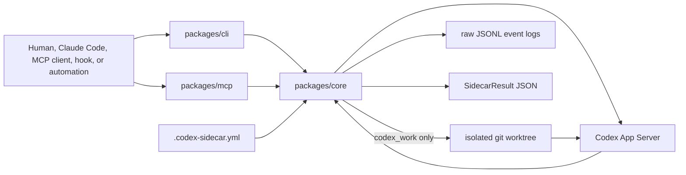

# codex-sidecar

<p align="center">
  
</p>

[](https://github.com/kitepon-rgb/codex-sidecar/actions/workflows/ci.yml)
[](LICENSE)

> Run Codex as a safe sidecar for reviews, exploration, risk checks, and small
> scoped fixes without handing it your active working tree.

[日本語 README](README.ja.md) | [Usage](docs/USAGE.md) | [Architecture](docs/ARCHITECTURE.md) | [Protocol](docs/PROTOCOL.md)

`codex-sidecar` is a shared execution layer for calling Codex from another
developer workflow. It gives humans, Claude Code, MCP clients, hooks, and other
automation a stable way to ask Codex for a second opinion while preserving
machine-readable results, raw App Server diagnostics, and safety boundaries.

It is not an OpenAI API gateway. It is not an image generation proxy. Its job is
to make Codex useful as a controlled companion process inside real repositories.

## 30 Seconds

Install the CLI globally:

```bash
npm install -g @codex-sidecar/cli
```

Install the MCP stdio server globally when a client wants a command on PATH:

```bash
npm install -g @codex-sidecar/mcp
```

Build from source:

```bash
corepack pnpm install
corepack pnpm build
```

Check how a target project config resolves:

```bash
codex-sidecar diagnostics \
  --project /path/to/project \
  --preset review
```

Ask Codex to explore a codebase through the real App Server:

```bash
codex-sidecar explore \
  --project /path/to/project \
  "Find where request safety is enforced and cite files."
```

Ask Codex to make a scoped fix in an isolated worktree:

```bash
codex-sidecar work \
  --project /path/to/project \
  --preset work \
  "Add the smallest regression test for the parser."
```

`codex_work` preserves the generated worktree by default so the caller can
inspect the diff before applying anything.

## What It Runs

| Workflow | Purpose | Writes? | Output highlights |
|---|---|---:|---|
| `codex_review` | Review a diff, branch, or patch | No | `findings`, `missingTests`, `residualRisks` |
| `codex_explore` | Investigate a codebase question | No | `summary`, `fileReferences` |
| `codex_opinion` | Challenge a plan or design | No | `recommendation`, `objections`, `assumptions` |
| `codex_risk_check` | Focus on secrets, MCP, OAuth, hooks, Docker, CI | No | `risks`, `sourceBoundaries` |
| `codex_work` | Implement a small scoped change | Isolated worktree only | `changedFiles`, `tests`, `worktreePath` |

Every workflow returns one `SidecarResult` JSON object. Downstream tools should
consume the structured fields instead of scraping prose.

## Why Not Just Use...

| Approach | What it is good at | Where `codex-sidecar` helps |
|---|---|---|
| Codex CLI directly | Interactive Codex sessions | Stable request/result JSON, raw logs, presets, and caller-owned safety policy |
| Claude Code alone | Primary implementation flow | Adds Codex as a second opinion without replacing Claude's working context |
| A bespoke MCP tool | One workflow in one repo | Shared CLI/MCP/core contracts across repositories |
| Direct active-tree automation | Fast local edits | `codex_work` keeps writes in a git worktree and reports changed files |

## Architecture



The CLI and MCP package stay thin. `packages/core` owns config loading, preset
resolution, safety policy, App Server protocol handling, structured output
parsing, raw event logs, and worktree isolation.

## Project Config

Consuming repositories provide `.codex-sidecar.yml`:

```yaml
project: example-project

defaults:
  readonly: true
  result_format: json

safety_profile: generic

allowed_paths:
  - src/
  - docs/
  - tests/

deny_paths:
  - .env
  - .env.*
  - "**/*.key"
  - "**/*.pem"

presets:
  review:
    workflow: review
    readonly: true
    prompt: "Review this change for regressions and missing tests."
  work:
    workflow: work
    readonly: false
    require_worktree: true
    prompt: "Implement a small scoped change within allowed_paths."
```

See [docs/USAGE.md](docs/USAGE.md) for CLI options, MCP input examples,
worktree behavior, raw App Server logs, and structured result examples.

## Ecosystem Fit

`codex-sidecar` was built for an environment where Claude Code is the primary
agent and Codex is a controlled sidecar. It is designed to compose with nearby
tools without requiring them:

- Relay stores and retrieves cross-device Claude conversation context.
- Throughline compresses Claude Code context and carries explicit handoffs.
- Caveat stores long-term trap memory and repo-specific gotchas.
- SmartClaude measures and optimizes token/context cost.
- CodeGraph provides local symbol graph context when a repository is initialized.
- image-generator and IP-MCP provide MCP/OAuth/deployment patterns and
  source-boundary lessons.

## Repository Layout

```text
codex-sidecar/
├─ docs/
│  ├─ PLAN.md
│  ├─ TODO.md
│  ├─ ARCHITECTURE.md
│  ├─ PROTOCOL.md
│  └─ USAGE.md
├─ examples/
│  └─ .codex-sidecar.yml
├─ packages/
│  ├─ core/
│  ├─ cli/
│  └─ mcp/
├─ package.json
├─ pnpm-workspace.yaml
└─ tsconfig.base.json
```

## Status

The current spine is functional:

- config validation and preset/request normalization
- path safety, safety profiles, and structured refusals
- stable `SidecarRequest` / `SidecarResult` types
- CLI commands for all workflows
- MCP tool descriptors, schemas, and core-backed handlers
- Codex App Server stdio client and read-only turn execution
- structured result normalization for read-only workflows
- raw App Server JSONL event logs with `rawEventLogRef`
- caller-selected turn timeouts and optional interruption
- worktree-backed `codex_work` with changed-file reporting
- ecosystem context adapters and fixture snapshots
- local CodeGraph index support for this repository

The current release is ready for npm-based CLI and MCP installation. Caveat
adoption is implemented through `caveat codex-sidecar ...` commands and optional
Claude hook advisory.

## Development

```bash
corepack pnpm typecheck
corepack pnpm test
corepack pnpm build
```

## Related Docs

- [AGENTS.md](AGENTS.md): working instructions for Codex and future agents.
- [docs/USAGE.md](docs/USAGE.md): CLI, MCP handler, worktree, raw log, and structured result examples.
- [docs/ARCHITECTURE.md](docs/ARCHITECTURE.md): package boundaries, layering, safety model, and result contract.
- [docs/PROTOCOL.md](docs/PROTOCOL.md): Codex App Server protocol boundary and stable sidecar contracts.
- [docs/PLAN.md](docs/PLAN.md): roadmap, phases, generic core, and ecosystem overlay.
- [docs/TODO.md](docs/TODO.md): durable task list and linked GitHub issues.

## License

MIT
