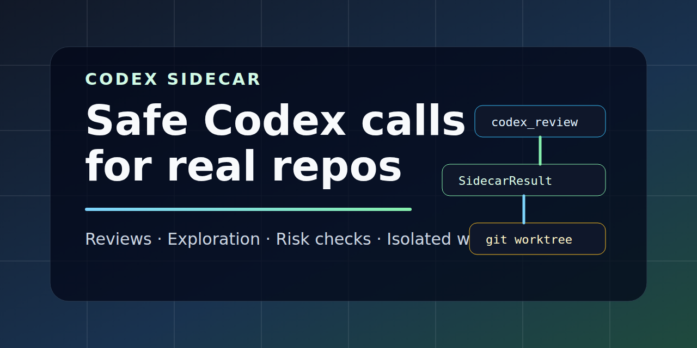
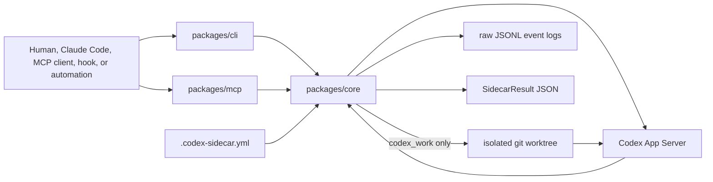

<p align="center">
  
</p>

# codex-sidecar

[](https://www.npmjs.com/package/codex-sidecar-cli)
[](https://www.npmjs.com/package/codex-sidecar-mcp)
[](https://github.com/kitepon-rgb/codex-sidecar/actions/workflows/ci.yml)
[](LICENSE)
[](https://nodejs.org)
[](https://github.com/kitepon-rgb/codex-sidecar/releases)

**English** · [日本語](README.ja.md)

> **Run Codex as a safe, isolated sidecar — and get machine-readable answers, not chat transcripts.**
> `codex-sidecar` lets humans, Claude Code, MCP clients, and hooks ask Codex for code review, exploration, risk checks, and scoped fixes, returning one structured `SidecarResult` JSON per call without ever touching your active working tree.

[Usage](docs/USAGE.md) · [Architecture](docs/ARCHITECTURE.md) · [Protocol](docs/PROTOCOL.md)

`codex-sidecar` is a shared execution layer for calling Codex from another
developer workflow. It gives humans, Claude Code, MCP clients, hooks, and other
automation a stable way to ask Codex for a second opinion while preserving
machine-readable results, raw App Server diagnostics, and safety boundaries.
Callers can let Codex inherit its configured model or set an explicit
per-request/preset model policy when a workflow needs one.

It is not an OpenAI API gateway. It is not an image generation proxy. Its job is
to make Codex useful as a controlled companion process inside real repositories.

## 30 Seconds

Install the CLI globally:

```bash
npm install -g codex-sidecar-cli
```

Install the MCP stdio server globally when a client wants a command on PATH:

```bash
npm install -g codex-sidecar-mcp
```

The MCP package is distributed as an npm `bin`. npm global installs normally
place a symlink on PATH, and `codex-sidecar-mcp` is tested to start correctly
through that symlinked command.

Build from source:

```bash
corepack pnpm install
corepack pnpm build
```

Check how a target project config resolves:

```bash
codex-sidecar diagnostics \
  --project /path/to/project \
  --preset review \
  --model gpt-5.5 \
  --model-reasoning-effort medium
```

Ask Codex to explore a codebase through the real App Server:

```bash
codex-sidecar explore \
  --project /path/to/project \
  "Find where request safety is enforced and cite files."
```

Ask Codex to make a scoped fix in an isolated worktree:

```bash
codex-sidecar work \
  --project /path/to/project \
  --preset work \
  "Add the smallest regression test for the parser."
```

`codex_work` preserves the generated worktree by default so the caller can
inspect the diff before applying anything.

## What It Runs

| CLI workflow | MCP tool | Purpose | Writes? | Output highlights |
|---|---|---|---:|---|
| `review` | `codex_review` | Review a diff, branch, or patch | No | `findings`, `missingTests`, `residualRisks` |
| `explore` | `codex_explore` | Investigate a codebase question | No | `summary`, `fileReferences` |
| `opinion` | `codex_opinion` | Challenge a plan or design | No | `recommendation`, `objections`, `assumptions` |
| `risk-check` | `codex_risk_check` | Focus on secrets, MCP, OAuth, hooks, Docker, CI | No | `risks`, `sourceBoundaries` |
| `auditor` | `codex_auditor` | Return a primary tool-use auditor judgment | No | `pass`, `missingTools` |
| `generate` | `codex_generate` | Generate arbitrary structured JSON for a freeform task | No | `generated` (raw JSON object/array) |
| `work` | `codex_work` | Implement a small scoped change | Isolated worktree only | `changedFiles`, `tests`, `worktreePath` |

Every workflow returns one `SidecarResult` JSON object. Downstream tools should
consume the structured fields instead of scraping prose. `status` is `ok`,
`failed`, `refused`, `dry-run`, or `partial` — the last meaning the turn completed
but its report drifted from the schema, so the raw report is preserved in
`unvalidatedReport` and any lossless coercions are disclosed in
`normalizationNotes` (see [docs/USAGE.md](docs/USAGE.md#degraded-report-status-partial)).
A `codex_review` call returns something like:

```json
{
  "status": "ok",
  "workflow": "review",
  "summary": "No blocking regressions found.",
  "confidence": {
    "level": "medium",
    "rationale": "The review inspected the changed files but did not run tests."
  },
  "recommendedNextAction": "Run the relevant package tests before merging.",
  "fileReferences": [
    { "path": "packages/core/src/requests.ts", "line": 42, "label": "request execution boundary" }
  ],
  "rawEventLogRef": "/path/to/project/.codex-sidecar/logs/app-server/..."
}
```

Workflow-specific fields layer on top of these common fields — `review` adds
`findings` / `missingTests` / `residualRisks`, `work` adds `changedFiles` /
`tests` / `worktreePath`, and so on. See
[docs/USAGE.md](docs/USAGE.md#structured-result-contract) for the full contract.

### Long-running work

The synchronous `work` workflow remains available for direct use. For work that
must survive an MCP stdio disconnect or a caller restart, use the asynchronous
work controls: CLI `work-start`, `work-result`, `work-cancel`, `work-recover`,
and `work-auth-recover`, or MCP `codex_work_start`, `codex_work_result`,
`codex_work_cancel`, `codex_work_recover`, and `codex_work_auth_recover`.
The caller supplies and retains an idempotency key; retrying the same key finds
the same durable run rather than starting another one. See
[docs/USAGE.md](docs/USAGE.md#asynchronous-work) for the control contract and
recovery constraints.

## Why Not Just Use...

| Approach | What it is good at | Where `codex-sidecar` helps |
|---|---|---|
| Codex CLI directly | Interactive Codex sessions | Stable request/result JSON, raw logs, presets, and caller-owned safety policy |
| Claude Code alone | Primary implementation flow | Adds Codex as a second opinion without replacing Claude's working context |
| A bespoke MCP tool | One workflow in one repo | Shared CLI/MCP/core contracts across repositories |
| Direct active-tree automation | Fast local edits | `codex_work` keeps writes in a git worktree and reports changed files |

## Architecture



The CLI and MCP package stay thin. `packages/core` owns config loading, preset
resolution, safety policy, App Server protocol handling, structured output
parsing, raw event logs, and worktree isolation.

## Project Config

Consuming repositories provide `.codex-sidecar.yml`:

```yaml
project: example-project

defaults:
  readonly: true
  result_format: json

safety_profile: generic

allowed_paths:
  - src/
  - docs/
  - tests/

deny_paths:
  - .env
  - .env.*
  - "**/*.key"
  - "**/*.pem"

presets:
  review:
    workflow: review
    readonly: true
    prompt: "Review this change for regressions and missing tests."
  work:
    workflow: work
    readonly: false
    require_worktree: true
    prompt: "Implement a small scoped change within allowed_paths."
```

See [docs/USAGE.md](docs/USAGE.md) for CLI options, MCP input examples,
worktree behavior, raw App Server logs, and structured result examples.

## LAN MCP Server (Docker)

`packages/mcp` ships both a stdio transport (the npm `bin` default) and a
Streamable HTTP transport. The HTTP mode lets a single host serve multiple
LAN-local MCP clients (Claude Code on other machines, hooks, automation)
without putting `codex-sidecar-mcp` on every workstation.

The repository includes a `Dockerfile` and `docker-compose.yml` that build the
MCP server and bind it to a chosen LAN IP only:

```bash
# On the host that will run the sidecar
git clone https://github.com/kitepon-rgb/codex-sidecar.git
cd codex-sidecar
docker compose up -d --build
```

The defaults bind to `192.168.1.2:39201/tcp` and mount `~/.codex` (Codex CLI
auth) and `~/projects` (consumer repos) into the container. Override per host
via env or a sibling `.env` file:

```bash
CODEX_SIDECAR_BIND_HOST=10.0.0.5 \
CODEX_SIDECAR_PORT=39201 \
CODEX_HOME_HOST=/home/alice/.codex \
PROJECTS_HOST=/home/alice/projects \
docker compose up -d --build
```

Add a firewall rule restricting access to the local subnet, e.g. with UFW:

```bash
sudo ufw allow from 192.168.1.0/24 to any port 39201 proto tcp comment 'codex-sidecar-mcp LAN'
```

Optional bearer-token enforcement is available via `CODEX_SIDECAR_MCP_BEARER`
in compose; clients then must send `Authorization: Bearer <token>`. DNS
rebinding protection (`CODEX_SIDECAR_MCP_ALLOWED_HOSTS`) is enabled by default
and must list both the bare host and `host:port` since the MCP SDK matches the
HTTP `Host` header verbatim.

Sample MCP client config:

```json
{
  "mcpServers": {
    "codex-sidecar-lan": {
      "type": "http",
      "url": "http://192.168.1.2:39201/mcp"
    }
  }
}
```

Callers must pass server-side paths in `projectRoot` (for example
`/projects/<repo>`), not paths from the client machine.

See [docs/USAGE.md](docs/USAGE.md#http-transport-and-lan-deployment) for the
full HTTP transport reference, env vars, and operational commands.

## Ecosystem Fit

`codex-sidecar` was built for an environment where Claude Code is the primary
agent and Codex is a controlled sidecar. It is designed to compose with nearby
tools without requiring them:

- [Relay](https://github.com/kitepon-rgb/Relay) stores and retrieves cross-device Claude conversation context.
- [Throughline](https://github.com/kitepon-rgb/Throughline) compresses Claude Code context and carries explicit handoffs.
- [Caveat](https://github.com/kitepon-rgb/Caveat) stores long-term trap memory and repo-specific gotchas.
- [SmartClaude](https://github.com/kitepon-rgb/SmartClaude) measures and optimizes token/context cost.
- CodeGraph provides local symbol graph context when a repository is initialized.
- [image-generator](https://github.com/kitepon-rgb/image-generator) and [IP-MCP](https://github.com/kitepon-rgb/IP-MCP) provide MCP/OAuth/deployment patterns and
  source-boundary lessons.

## Repository Layout

```text
codex-sidecar/
├─ rag/
│  └─ INDEX.md
├─ docs/
│  ├─ 00_OVERVIEW.md
│  ├─ README.md
│  ├─ adr/
│  ├─ TODO.md
│  ├─ ARCHITECTURE.md
│  ├─ PROTOCOL.md
│  ├─ USAGE.md
│  └─ archive/
├─ examples/
│  └─ .codex-sidecar.yml
├─ packages/
│  ├─ core/
│  ├─ cli/
│  └─ mcp/
├─ package.json
├─ pnpm-workspace.yaml
└─ tsconfig.base.json
```

## Status

The current spine is functional:

- config validation and preset/request normalization
- path safety, safety profiles, and structured refusals
- stable `SidecarRequest` / `SidecarResult` types
- CLI commands for all workflows
- MCP tool descriptors, schemas, and core-backed handlers
- Codex App Server stdio client and read-only turn execution
- structured result normalization for App Server-backed workflows
- raw App Server JSONL event logs with `rawEventLogRef`
- caller-selected turn timeouts and optional interruption
- worktree-backed `codex_work` with changed-file reporting
- ecosystem context adapters and fixture snapshots
- local CodeGraph index support for this repository

The current release is ready for npm-based CLI and MCP installation. The MCP
stdio server is verified against npm-style symlinked `bin` startup, which is the
normal path for Claude Code and other MCP clients that launch
`codex-sidecar-mcp` from PATH. Caveat adoption is implemented through
`caveat codex-sidecar ...` commands and optional Claude hook advisory.

## Development

```bash
corepack pnpm typecheck
corepack pnpm test
corepack pnpm build
```

## Related Docs

- [AGENTS.md](AGENTS.md): working instructions for Codex and future agents.
- [docs/00_OVERVIEW.md](docs/00_OVERVIEW.md): canonical docs entrypoint.
- [docs/README.md](docs/README.md): docs index and archive map.
- [docs/USAGE.md](docs/USAGE.md): CLI, MCP handler, worktree, raw log, and structured result examples.
- [docs/ARCHITECTURE.md](docs/ARCHITECTURE.md): package boundaries, layering, safety model, and result contract.
- [docs/PROTOCOL.md](docs/PROTOCOL.md): Codex App Server protocol boundary and stable sidecar contracts.
- [docs/TODO.md](docs/TODO.md): durable task list and linked GitHub issues.
- [docs/archive/CODEX_MODEL_POLICY_TODO.md](docs/archive/CODEX_MODEL_POLICY_TODO.md): archived completed Codex model policy plan.

## License

MIT
